🎓 EduElevate
EduElevate is a modern, feature-rich EdTech platform built to revolutionize online learning. It empowers students and educators with a seamless experience for teaching, learning, course management, and skill development — all in one place.

🚀 Features
📚 Course Catalog: Explore a variety of courses across domains like programming, data science, design, and more.

👩‍🏫 Instructor Dashboard: Easily create, manage, and publish courses with multiple chapters and video content.

🎥 Video Player: Smooth, distraction-free video playback experience with support for chapters and timestamps.

🔐 Authentication: Secure login and signup using JWT (JSON Web Tokens) or Firebase Auth.

📈 Progress Tracking: Learners can track their course progress chapter-wise.

💳 Payments: Integrated Razorpay for secure course payments.

📱 Responsive Design: Works across all devices – mobile, tablet, and desktop.

🔍 Search & Filter: Quickly find relevant courses using search and category filters.

🧑‍💻 Tech Stack
Frontend

React / React Native (with Expo Router)

Tailwind CSS

Axios for API calls

Backend

Node.js

Express.js

MongoDB (Mongoose)

Others

Razorpay (Payment Integration)

Git & GitHub (Version Control)

Vercel / Render (Deployment)

📦 Installation
Frontend
cd frontend
npm install
npm run dev  # or npm run start
Backend
cd backend
npm install
node index.js  # or nodemon index.js
🌐 Deployment
Frontend: Render

Backend: Render 

Database: MongoDB Atlas

📸 Screenshots

 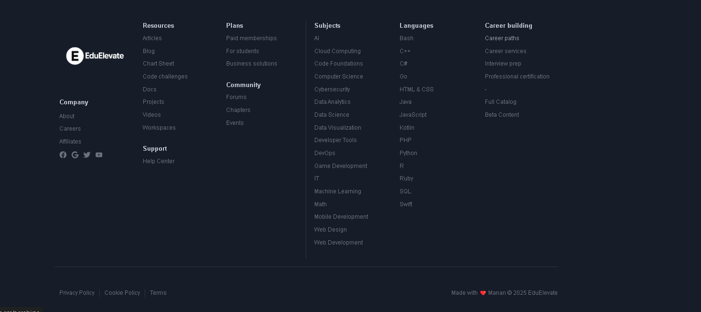    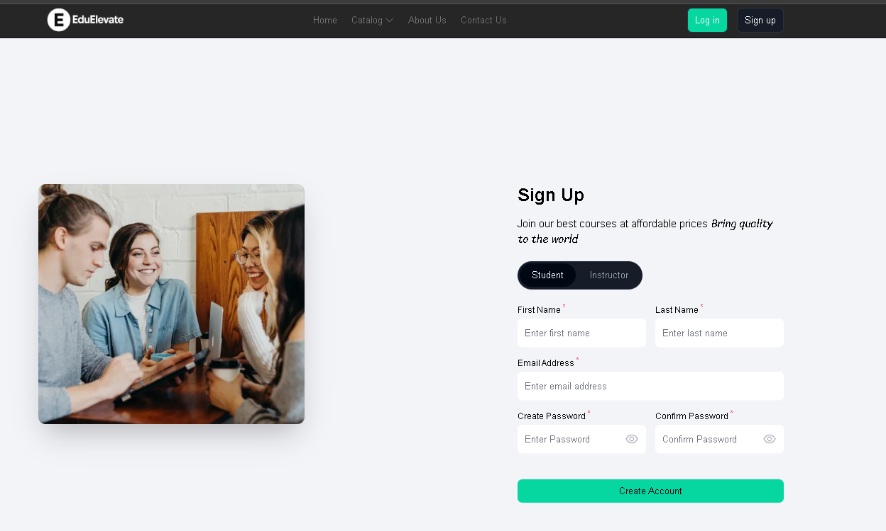 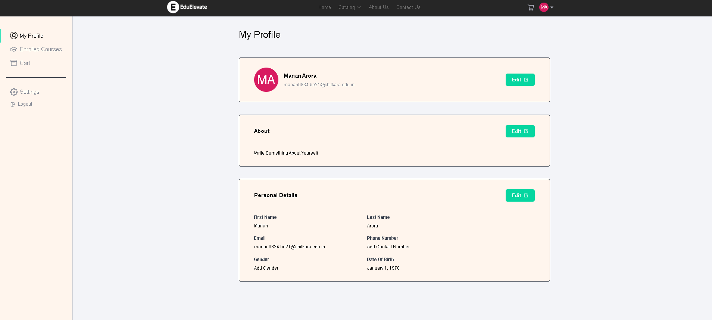 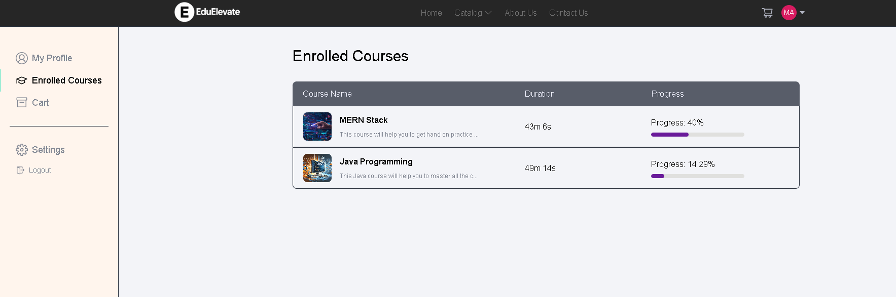 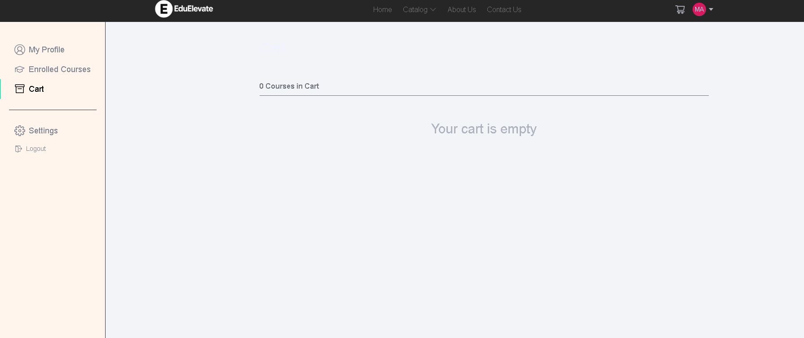 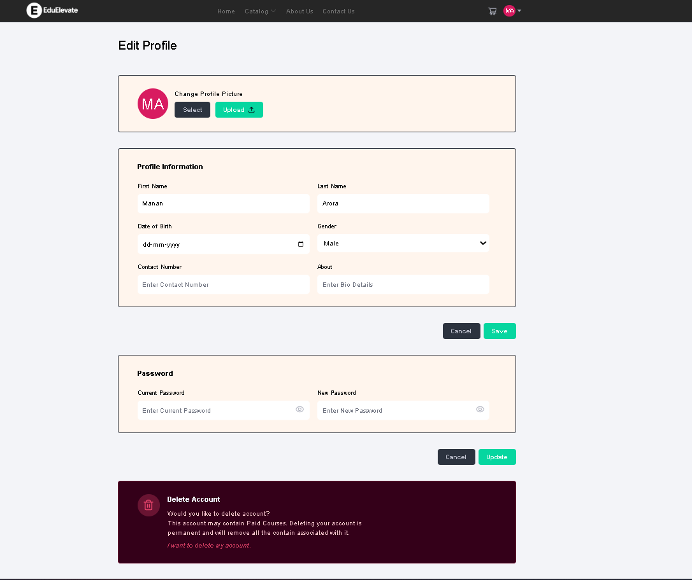 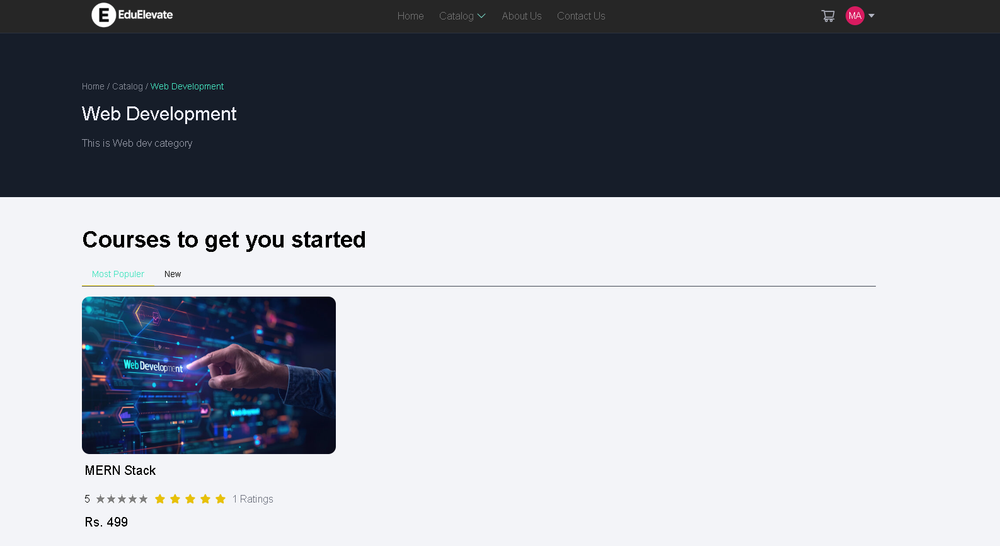 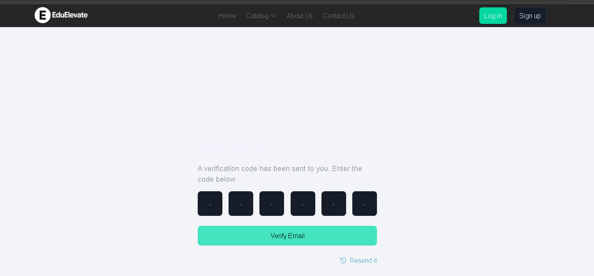 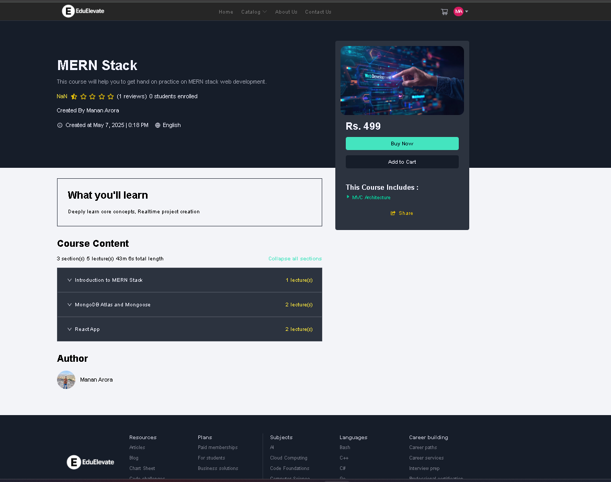 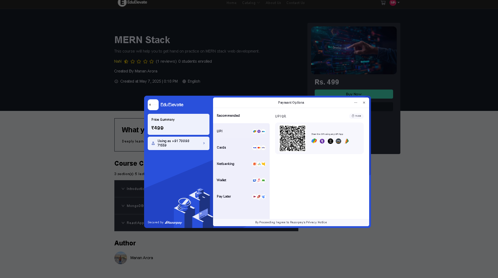  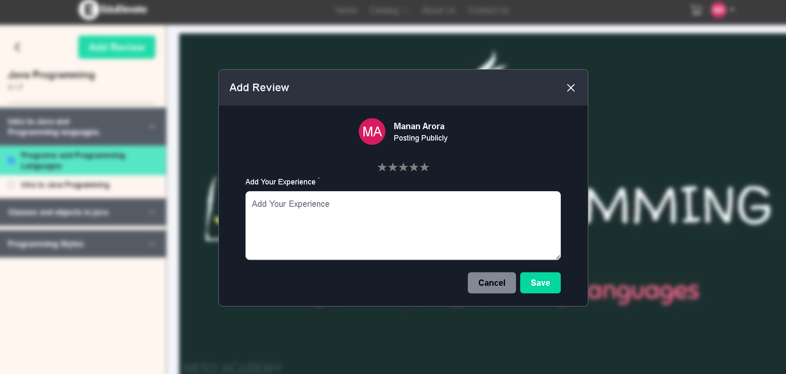 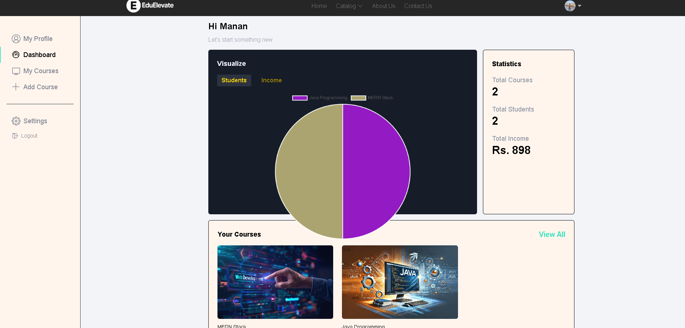 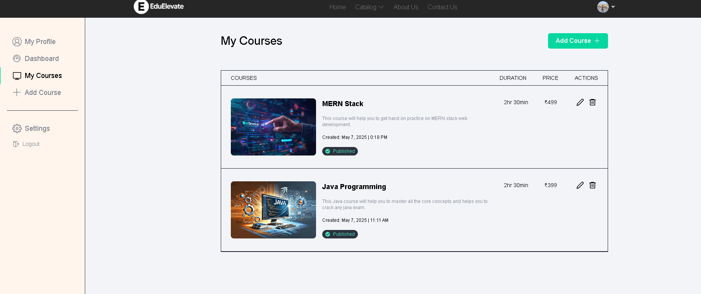 